# Table of Contents

1. Introduction
2. Overview
3. Method
   - Lightweight Initial Pose Estimation
   - Sampling Gaussian Primitives
   - Joint Pose and Gaussian Optimization and Scheduling
   - Scalable Incremental Gaussian Construction
4. Results and Evaluation
5. Discussion
6. Conclusion

---

# Introduction

## 연구 배경
- **Neural radiance fields (NeRF)**와 **3D Gaussian Splatting (3DGS)**는 최근 NVS 품질·속도에서 큰 진전
- **3DGS**: 실시간 렌더링과 높은 시각 품질을 동시에 달성
- **수요**: 속도(on-the-fly) + 안정적 포즈 + 고품질 재구성 + 대규모 처리 요구

## 기존 접근법 한계
- **SfM + 3DGS**: 정확하지만 전체 파이프라인이 시간 및 메모리 측면에서 비실용적
- **SLAM 기반**: 실시간이나 wide-baseline / 대규모에서 실패 또는 화질 저하
- **3DGS Densification**: 초기 포인트 의존, 반복 최적화 비용 증가

## 성과
- **On-the-fly 3D reconstruction**: scene-ready에 pose와 radiance field 제공

<!-- Image/Table Placeholder -->

  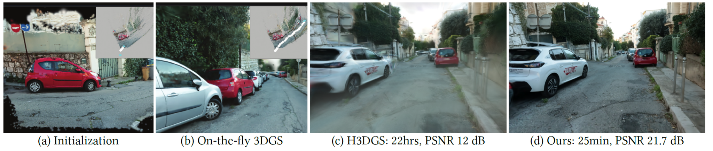
  
Fig. 1. Our method performs on-the-fly reconstruction from an unposed, ordered image sequence.

---

# Overview

## 제안 방법

- **Input Dataset**: Ordered image sequence
- **Feature extraction & bootstrapping**: 
  - 초기 프레임 $N_{init}=8$에서 exhaustive matching + mini-BA로 initial pose/point map 생성
- **Incremental pose estimation**: 
  - 새 프레임은 최근 $N=6$개 프레임과 매칭
  - GPU-parallel RANSAC + mini-BA로 빠르게 초기화
- **Direct Gaussian sampling**: 
  - LoG 기반 픽셀 확률로 primitive 위치 선정
  - Monocular depth + guided matching으로 깊이 보정 및 기대거리로 크기 초기화
- **Joint optimization**: 
  - Poses와 Gaussian을 함께 최적화 (sparse-Adam, coarse-to-fine)
- **Anchors & merging**: 
  - Active set을 오프로드해 anchors에 저장, k-NN 병합으로 LOD 관리 → 대규모 장면 처리

<!-- Image/Table Placeholder -->

  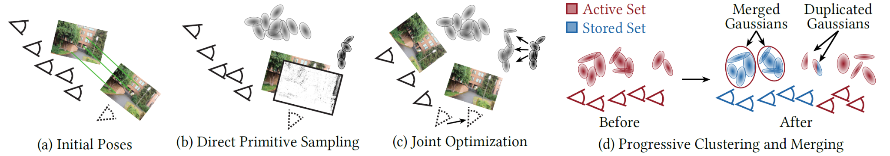
  
Fig. 2. Overview of our method

---

# 기존 3DGS와 비교 

 
Table 0. 3DGS vs On-the-Fly NVS.

  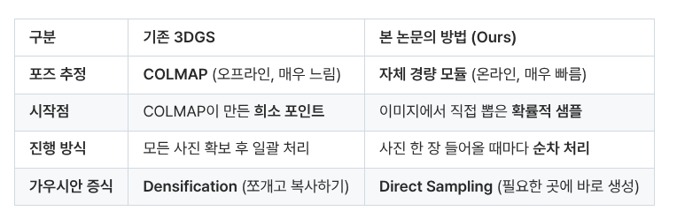

---

# Method: Lightweight Initial Pose Estimation (1/2)

## 목적
- 촬영 도중 또는 촬영 직후에 즉시 사용할 수 있는 근사 camera pose를 빠르게 얻기 위함
- 이후 joint optimization으로 정밀 보정

## 원칙
- **GPU friendly**
  - 메모리 접근과 연산을 GPU에서 효율적으로 처리하도록 mini-BA를 직접 구현
  - 문제를 고정 크기의 sparse Jacobian으로 재구성하여 GPU에서 병렬 처리 가능하도록 함
- **Fixed-Size Keypoint**
  - 프레임 당 많은 keypoint 대신 6144개로 제한하여 GPU 메모리/대역폭 비용 감소

---

# Method: Lightweight Initial Pose Estimation (2/2)

## 단계 개요

- **Feature Extraction**
  - 각 이미지에서 **XFeat** 기반 사용해 feature 추출
  <!-- - GPU/half-precision과 CUDA 그래프 기법으로 가속 가능 -->
- **Bootstrapping**
  - 첫 $N_{init}=8$ 프레임이 모이면, exhaustive pairwise matching 후 **LM 기반 mini-BA**
  - 각 3D point가 고정된 수의 이미지에서 관측되도록 문제 재구성 → 고정 크기 sparse Jacobian 구성
  - 블록 크기가 고정되어 memory pre-allocation과 독립적 연산 가능 → GPU에서 병렬 처리 유리
- **후속 프레임 처리**
  - 새 frame을 직전 $N=6$ registered frames와 매칭
  - 3D-2D correspondences 위해 과거 프레임들로 triangulation하여 depth 추정 (실패 시 rendering된 이미지에서 depth 추정)
  - 이후 GPU-parallel RANSAC으로 초기 pose와 inliers 추정 및 mini-BA 20번 반복
  - Triangulation한 각 keypoint에 대해 3D Gaussian primitive 생성
  - transitive matching으로 인한 데이터 가변 문제를 직전 $6$개 프레임으로 제한하여 크기 고정

---

# Method: Sampling Gaussian Primitives (1/4)

## 목적
- 기존 3DGS는 이미지 전체에 균일하게 혹은 keypoint에 배치하여 입력 이미지 특징에 적응하지 못하거나 희소한 경향 존재
- Densification의 overhead와 단점을 피하고 각 frame에서 즉시 **3D Gaussian primitives sampling**
- 재구성되지 않은 영역을 채우고, coarse-to-fine 방식으로 보강하여 불필요한 중복 생성을 줄여 3DGS 최적화 비용과 시간 줄임

## 원칙
- **Coverage & Detail**
  - unseen region에 대해 새로운 primitive를 배치하여 재구성되지 않은 영역을 채움
  - coarsely reconstructed 영역에 gaussain primitives 배치해 점진적으로 세부 묘사 향상
  &rarr; 입력 이미지에 LoG 필터 적용해 고주파 성분 강한 곳을 찾아 초기 확률 정의하고 경계 양쪽에 2개 peak 생성해 edge 표현 강화

- **Efficiency & Anti-Redundancy**
  - 중복 생성을 방지하기 위해 기존 재구성 정보 활용
  &rarr; 현재 Active Gaussians로 rendering된 이미지의 LoG 필터 적용해 패널티맵 생성

- **Guided matching**
  - Monocular depth (Depth-Anything-2)를 초기 깊이로 사용하되, 깊이 보정하는 정교화 진행
- **Scale initialization**
  - k-NN 기반 초기화는 edge 주변에서 과대 scale/outlier 민감성 문제가 존재하므로, 픽셀 공간에 기대거리(포아송 가정)으로 scale 결정함으로써 완화

---

# Method: Sampling Gaussian Primitives (2/4)

## 단계 개요: Input Data
- 현재 프레임 이미지, 현재 Active Gaussians으로부터 rendering한 이미지, initial pose and depth

## 단계 개요: 확률 계산
1. **입력 이미지 LoG 기반 초기 확률 계산**
  $P_L(x,y) = \min (\nabla^2(n_\sigma) * I(x,y), 1)$
2. **Rendering된 이미지로부터 penalty 계산**
  $\tilde{P}(x,y) = \min (\nabla^2(n_\sigma) * \tilde{I}(x,y), 1)$
3. **최종 sampling 확률 계산**
  $P_s(x,y) = \max (P_L(x,y) - \tilde{P}(x,y), 0)$

---

# Method: Sampling Gaussian Primitives (3/4)

## 단계 개요: 선택된 peak들에 대해 depth 추정 및 보정

- **Initial depth**: Monocular depth from Depth-Anything-2
- Monocular depth를 triangulated matches와 정렬 후 **guided matching**으로 최종 depth 결정
- **후보 inverse-depth 범위**: 각 후보 깊이에 대해 reprojection 좌표 및 feature correlation 확인

## 단계 개요: Primitive scale 초기화

- 픽셀 공간에서 기대 nearest-neighbor 거리 (2D Poisson 가정)
- 픽셀으로부터 3D scale 변환

---

# Method: Sampling Gaussian Primitives (4/4)

## 단계 개요: Gaussian 생성 및 초기 파라미터 설정

- **3D 위치**: $(x,y,z)$로 backprojection → Gaussian center
- **Scale**: Gaussian primitive의 크기
- **Color/SH 초기화**: Peak 색상 등으로 초기화
- **Opacity 초기화**: 적절한 값으로 시작, 이후 opacity culling 적용

## Joint optimization (Poses + Gaussians)으로 정교화
- Sampling된 Gaussians 및 camera pose 함께 최적화
- 초기 sampling으로 densification 반복이 감소하고, 최적화 속도 개선됨

<!-- Image/Table Placeholder -->

  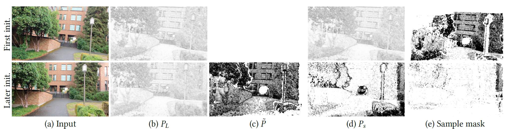
  
Fig. 5. Direct sampling to place new primitives during joint optimization

---

# Method: Joint Pose and Gaussian Optimization and Scheduling (1/2)

## 목적
- Initial guess (pose + Gaussian)를 빠르고 안정적으로 정제하기 위함
- 최적화 속도 향상 및 local minima에 빠지는 위험 감소 위함
- 더 넓은 baseline과 대규모 장면을 처리 가능하게 만들기 위함

## 원칙
- **Keyframe 선별**: 
  - 모든 프레임을 등록하지 않고 의미 있는 parallax가 있는 경우에 등록해 중복 줄임 (Keypoint의 median displacement > 3% * screen width)
- **제한된 반복/빠른 optimizer**: 
  - 각 등록된 이미지에 대해 30번의 Gaussian splatting optimization을 반복 수행하고 sparse-Adam으로 속도 향상
- **Per-Gaussian 학습률**: 
  - 각 Gaussian에 대해 도입 시점에 기반한 개별 학습률 부여, 도입 시점 이후로 decay 적용
- **Gradient 흐름 제어**: 
  - Pose 최적화로 Gaussian position과 rotation 관련 gradient만 흐르게 함
- **Coarse-to-fine scheduling**: 
  - 저주파로부터 먼저 학습하고, 점진적으로 고해상도 세부 학습하도록 설정
  - 각 이미지 추가 시 다운샘플로 시작, 5 iter마다 1씩 감소시켜 최종적으로 원해상도에 도달
- **Densification 회피 및 정리**: 
  - 전통적 densification 대신 직접 sampling으로 매우 낮은 opacity의 primitive는 opacity culling으로 제거

---

# Method: Joint Pose and Gaussian Optimization and Scheduling (2/2)

## 단계 개요
&rarr;*사전에 새 프레임에 대한 초기 pose가 추정되어있고, sampling으로 Gaussian 위치와 크기를 확보했다고 가정*

1. **Keyframe 결정**
   - 각 Keyframe마다 최적화 scheduling 수행
2. **Gaussian splatting joint optimization**
   - 30 iteration per images, sparse-Adam
   - Per-Gaussian learning rate 적용 및 decay 적용
3. **Pose parameter optimization**
   - 6D representation
   - 해상도에 대해 Coarse-to-Fine 기법 적용
4. **Primitive 정리**
   - Densification 수행 대신 opacity culling으로 기여도가 매우 낮은 Gaussian 삭제

&rarr;*Joint optimization을 통해 pose와 3DGS 표현이 정제 되어 이후 anchor 기반 대규모 처리에 사용*

---

# Method: Scalable Incremental Gaussian Construction (1/2)

## 목적
- 대규모 장면을 순차적 이미지 캡처 중 실시간에 가까운 속도로 처리 위함
- GPU 메모리와 연산 안정하도록 유지 및 장면 전체를 점진적으로 구성하도록 함
- 현재 시점에서 기여도가 낮은 가우시안은 GPU에서 CPU RAM으로 내려 저장하고, 필요 시 다시 불러와 렌더링, 최적화할 수 있도록 함

## 원칙
- **Active vs Stored 분리**
  - **Active Gaussians**: 현재 GPU에서 최적화되고 rendering되는 가우시안 집합
  - **Stored (Anchor)**: GPU에서 내려 CPU RAM에 보관되는 클러스터/anchor 단위의 가우시안 집합
- **화면 기여도 기반 오프로드**
  - 각 가우시안의 화면상 크기(기여도)를 계산하여 작게 보이는 것들은 오프로드/병합 대상으로 판단
- **화면 상 크기 정의**: Sliding window 처리
  - 시퀀스 진행에 따라 anchor 생성·병합을 반복하여 먼 영역은 점차 coarse(거칠게) 표현
- **Blending**
  - 렌더링 시 카메라 근처의 anchor를 선택하고, 필요 시 두 anchor를 선형 블렌딩하여 seam smoothing

---

# Method: Scalable Incremental Gaussian Construction (2/2)

## 단계 개요

- **Anchor 감지**
  - 현재 카메라 위치에서 Active Gaussian 화면상 크기 계산해 조건에 부합할 시 anchor 생성
- **Clustering 및 Gaussian 병합**
  - Active Gaussian 집합을 anchor로 복사하여 stored
  - 병합 대상 판단하여 선택 후 병합, 나머지는 필요 시 복제해 새로운 Active 집합 구성
- **Sliding window 기반 점진 최적화**
  - 병합으로 얻은 coarser한 Active 집합을 다음 최적화 반복에서 사용
  - Sequence 진행 시 반복적으로 anchors 생성, 멀리있는 영역이 거칠게 병합되어 메모리 연산 부담 유지
  - 캡쳐 종료 시 마지막 Active 집합도 anchor로 저장
- **Rendering 시 Anchor 선택 및 blending**
  - 현재 카메라 위치에 가장 가까운 anchor 선택해 rendering
  - 두 anchor가 유사한 거리에 있으면 선형 blending

---

# Result and Evaluation

## 실험 개요

- **평가 목표**: On-the-fly 처리 가능성(품질·속도·확장성) 검증
- **비교 대상**: Pose‑free 방법 및 SfM 기반 3DGS (대표: Photo‑SLAM, MonoGS, Taming 3DGS, H3DGS 등)
- **데이터셋**: TUM, MipNeRF360, StaticHikes, SmallCity, Wayve, CityWalk
- **주요 지표**: PSNR / SSIM / LPIPS / 처리시간 / Pose APE/RPE

## Datasets & Evaluation Protocol
- **TUM**: Dense SLAM‑style capture (video)
- **MipNeRF360**: Wide‑baseline NVS scenes (garden, counter, bonsai)
- **StaticHikes**: Intermediate wide‑baseline large scenes
- **SmallCity, Wayve, CityWalk**: 대규모 경로 (수백 m ~ 1.1 km) 평가용
- **하드웨어**: Intel Core i9‑14900K, 128GB RAM, NVIDIA RTX 4090 기준 성능 보고
- **평가 프로토콜**: Test view sampling 규칙 (데이터셋별 every‑n), 방법별 pose 가용성 고려한 통일된 테스트셋 구성

---

# Result and Evaluation (NVS Quality)

## NVS Quality
- **TUM, MipNeRF360, StaticHikes**의 PSNR / SSIM / LPIPS 및 전체 처리시간 비교
- 대부분 데이터셋에서 화질 확보 및 on‑the‑fly 처리시간 우위

<!-- Image/Table Placeholder -->

 
Table 1. Reconstruction time and novel view quality results for different methods.

  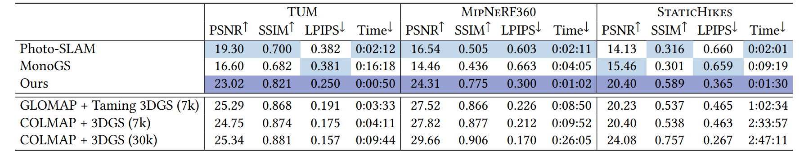

<!-- Image/Table Placeholder -->

  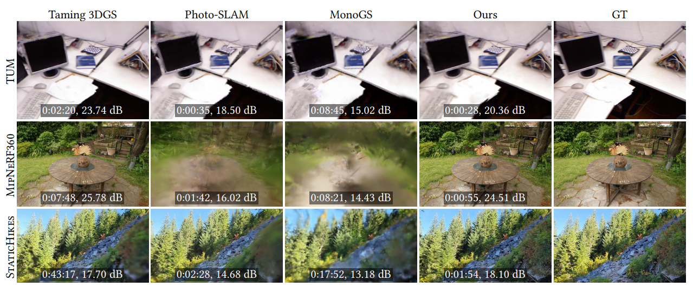
  
Fig. 7. Qualitative comparison for the three datasets used, for Taming 3DGS, Photo-Slam, MonoGS

---

# Result and Evaluation (Low-resolution)

## Low-resolution 비교
- **DROID‑Splat, CF‑3DGS** 등 저해상도 대상 방법과의 PSNR / SSIM / LPIPS 및 처리시간 비교
- 저해상도 전용 기법의 강점 존재, 우리 방법은 고해상도 입력에서 설계된 강점 유지

<!-- Image/Table Placeholder -->

 
Table 2. Novel view quality results for different methods that require low-resolution input.

  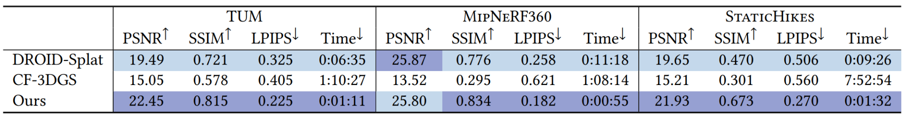

<!-- Image/Table Placeholder -->

  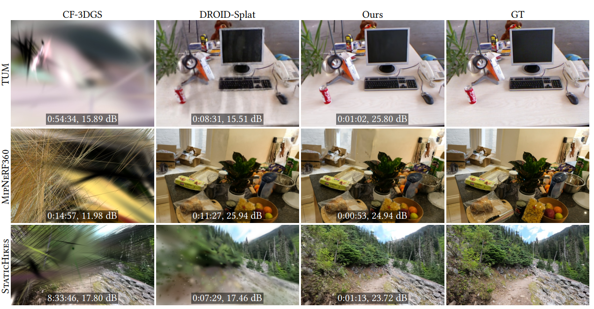
  
Fig. 8. Qualitative comparison of pose-free methods for the three datasets used, for CF-3DGS and DROID-Splat that only handle low resolution

---

# Result and Evaluation (Large-scale)

## Large‑scale scenes 비교
- **SmallCity, Wayve, CityWalk**의 PSNR / SSIM / LPIPS 및 전체 처리시간 비교 (H3DGS 대비)
- 대규모에서 처리시간 우위 (예: CityWalk --- Ours ≈ 25 min vs H3DGS ≈ 22 hrs) 및 전반적 실용성 우위

<!-- Image/Table Placeholder -->

  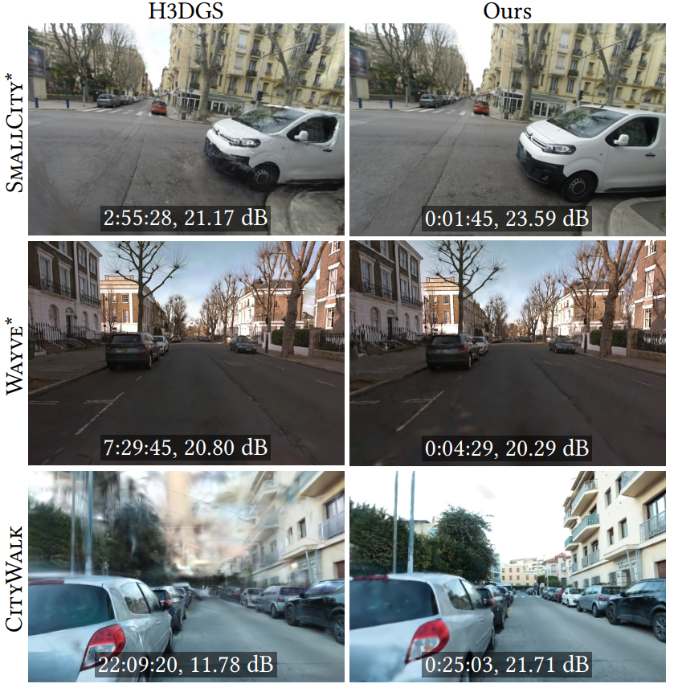
  
Fig. 9. Qualitative comparison of large-scale methods for the three datasets used.

<!-- Image/Table Placeholder -->

 
Table 4. Results for large scale scenes.

  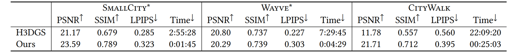

---

# Result and Evaluation (Pose & Runtime)

## Pose estimation Quality
- 각 방법 별 **APE / RPE** 비교
- MipNeRF360에서 우수한 결과, TUM에서는 캡처 아티팩트 (rolling shutter, blur) 영향으로 저하 사례 존재

## Runtime breakdown
- Per‑keyframe 단계별 시간 분해 (Feature extraction, matching, mini‑BA, depth, sampling, joint optimization 등)
- Joint optimization이 가장 오래 소요되는 단계, mini‑BA 및 bootstrapping은 CUDA graphs로 고속화

<!-- Image/Table Placeholder -->

  
  

    
Table 5. Pose estimation results for different methods using absolute and relative error metrics.

    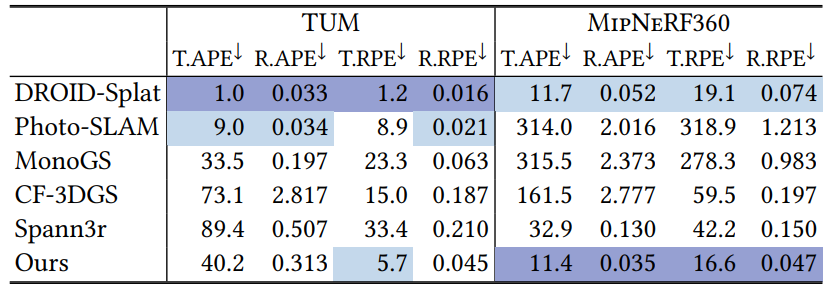
  

  

    
Table 6. Per keyframe runtime breakdown.

    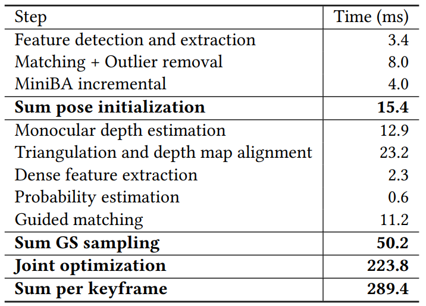
  

---

# Result and Evaluation (Ablation)

## Ablation studies
- **NoSampling, NoShape, NoGuided, NoJoint** 대조 결과
- Expectancy‑based scale 초기화의 중요성(가장 큰 영향), sampling 기여 향상, uniform 슬라이드 시 primitives 수 증가

<!-- Image/Table Placeholder -->

 
Table 8. Ablation results.

  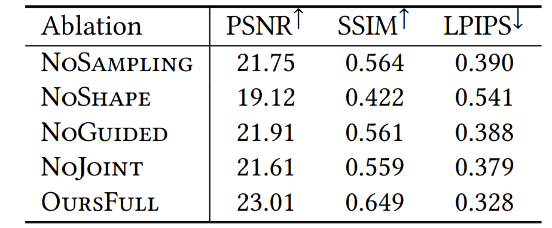

<!-- Image/Table Placeholder -->

  
  

    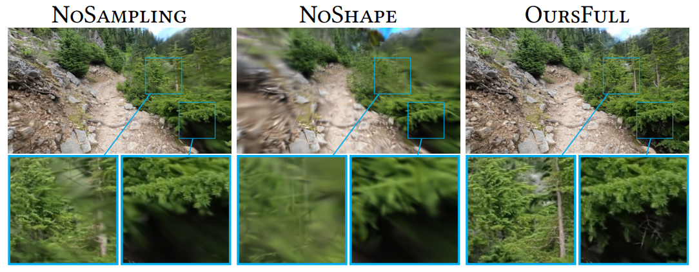
    
Fig. 10. Qualitative evaluation of the various components via ablation studies on Forest2.

  

  

    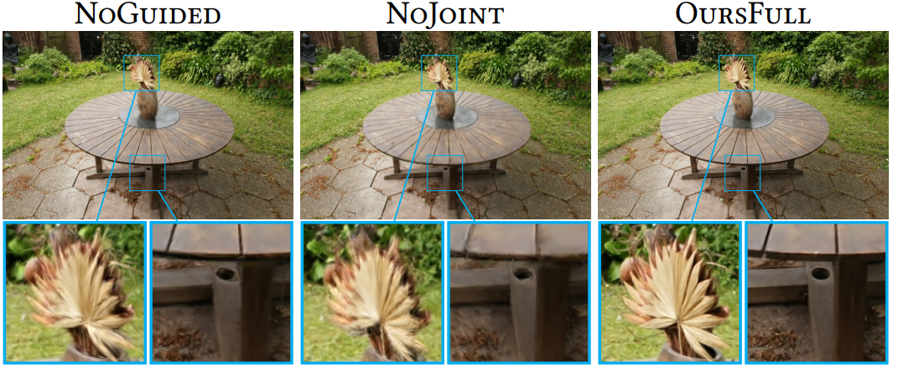
    
Fig. 11. Qualitative evaluation of the various components via ablation studies on Garden.

  

---

# Result and Evaluation (Anchors)

## Anchor 영향 및 확장성
- Anchors 사용 전후 비교 (PSNR, SSIM, LPIPS, peak GS 감소)
- Anchors 사용으로 peak Gaussians 수 감소 및 품질 소폭 개선, 대규모 장면에서 GPU 메모리 안정화 효과

<!-- Image/Table Placeholder -->

 
Table 7. Impact of the anchors on Forest2.

  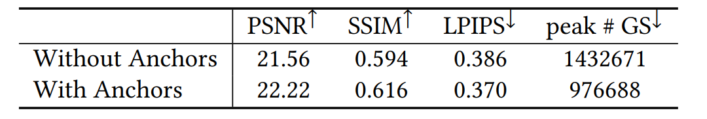

<!-- Image/Table Placeholder -->

  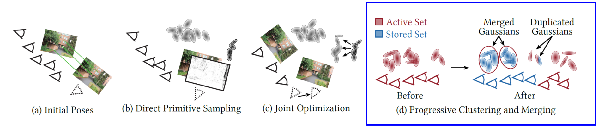
  
Fig. 2. Overview of our method

---

# Discussion

## On-the-fly 방식의 장점
- 즉각적인 피드백을 제공하여 **사용자 친화적인 3D 재구성**을 가능하게 함
- 사진 기반 3D 캡처 과정을 크게 단순화하고 가속화

## 한계점
- **Ordered Image Sequences 의존**: 이미지가 순서대로 캡처되었다는 가정
- **Loop Closure 부재**: 카메라가 이전에 방문했던 영역으로 돌아올 때 발생할 수 있는 누적 오차를 줄이거나 지도 갱신에 한계 존재
- **최소 해상도 요구사항**: 최소 1000픽셀 너비 이상의 해상도를 가진 이미지 필요
- **Casual Capture Artifacts 처리 미흡**: Blur, saturation, lens flare, moving objects 등 일반적인 촬영 과정에서 발생할 수 있는 아티팩트들을 명시적으로 처리하지 않음

---

# Conclusion

- **Ordered image sequence**로부터 **on-the-fly**로 대규모 카메라 Pose 추정 및 3D 재구성 수행하는 새로운 접근 방식을 제시
- 즉각적인 피드백과 함께 **Novel View Synthesis** 가능케 함
- Dense한 SLAM 스타일 비디오, wide-baseline radiance field 캡쳐, 1km 이상의 대규모 순차적 이미지 캡쳐 등 **다양한 캡쳐 스타일 처리 가능**
- 특정 캡처 스타일이나 장면 크기에 특화된 최고 수준의 기존 솔루션들과 비교하였을 때, **속도 및 이미지 품질 면에서 경쟁력**을 갖추고 있으며, 모든 시나리오를 처리할 수 있는 몇 안 되는 방법 중 하나임을 입증

---

class: center, middle

# 감사합니다

