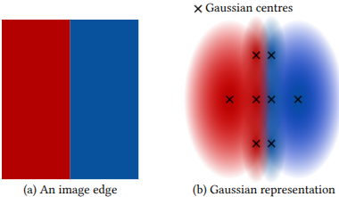
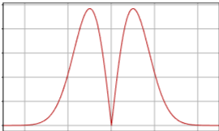

# Table of Contents
.pull-left.content-list[
1. Introduction
2. Overview
3. Method
   - Lightweight Initial Pose Estimation
   - Sampling Gaussian Primitives
   - Joint Pose and Gaussian Optimization and Scheduling
   - Scalable Incremental Gaussian Construction
4. Results and Evaluation
5. Discussion
6. Conclusion
]
---
class: inverse, middle, center, title-slide
# Introduction
---
# Introduction
.f-80[  
- **Neural radiance fields (NeRF)**와 **3D Gaussian Splatting (3DGS)**는 최근 NVS 품질·속도에서 큰 진전  
- 속도(on-the-fly) + 안정적 포즈 + 고품질 재구성 + 대규모 처리 요구에 대한 수요 증가
- **SfM + 3DGS**: 정확하지만 전체 파이프라인이 시간 및 메모리 측면에서 비실용적
- **SLAM 기반**: 실시간이나 wide-baseline / 대규모에서 실패 또는 화질 저하
- **3DGS Densification**: 초기 포인트 의존, 반복 최적화 비용 증가  
]
&rarr;On-the-fly 3D reconstruction: scene-ready에 pose와 radiance field 제공

.center[

.caption[Fig. 1. Our method performs on-the-fly reconstruction from an unposed, ordered image sequence.]]

---
.na-01[
# Overview
]
.f-80[
.nb-01[
- **Input Dataset**
  - Ordered image sequence
]
.nb-01[
- **Feature Extraction & Bootstrapping**
  - 초기 프레임 $N_{init}=8$에서 exhaustive matching + mini-BA로 initial pose 및 point map 생성
]
.nb-01[
- **Incremental Pose Estimation**
  - GPU-parallel RANSAC + mini-BA로 빠르게 초기화
]
.nb-01[
- **Direct Gaussian Sampling**
  - LoG 기반 픽셀 확률로 primitive 위치 선정
  - Monocular depth + guided matching으로 깊이 보정
]
.nb-01[
- **Joint Optimization**
  - Poses와 Gaussian을 함께 최적화
]
.nb-01[
- **Anchors & Merging**
  - 대규모 장면 처리 위해 Active set 오프로드해 anchors에 저장, k-NN 병합으로 LOD 관리
]
]
.center[

.caption[Fig. 2. Overview of our method]
]
---

# 기존 3DGS와 비교 
.caption.center.nb-01[3DGS vs On-the-Fly NVS.]

| | 3DGS | On-the-fly NVS |
|:---|:---|:---|
|Pose Estimation| Offline SfM (COLMAP)   | Online Lightweight Module|
|Primitives scale| 3D 3-Nearest Neighbor |Poisson-based Expectancy |
| Data Processing | Batch, Post-Capture | Incremental, Concurrent|
| Densification | View-space Positional Gradient  (Cloning & Splitting) | Direct Sampling  (LoG)|
|Scene Scalability | Limited (VRAM-bound) | Large-scale (Anchor-based)

---
class: inverse, middle, center, title-slide
# Method
## Lightweight Initial Pose Estimation
---
## Motivation & Core Principles
.f-90[
- 촬영 직후 즉시 사용할 수 있는 근사 pose를 빠르게 얻기 위함 

- **GPU friendly**
  - 메모리 접근과 연산을 GPU에서 효율적으로 처리하도록 mini-BA를 직접 구현
  - 문제를 고정 크기의 sparse Jacobian으로 재구성하여 GPU에서 병렬 처리 가능하도록 함
  
- **Fixed-Size Keypoint, Jacobian**
  - 프레임 당 많은 keypoint 대신 6144개로 제한하여 GPU 메모리/대역폭 비용 감소
  - transitive matching으로 인한 데이터 가변 문제를 직전 $6$개 프레임으로 제한하여 크기 고정
  <!--키포인트가 여러 이미지에서 보일수 있음, 고정 크기 문제 유지 위해 6개 프레임으로만 제한  -->
]
---

## Key Procedures
.f-90[
1. **Feature Extraction**
  - 각 이미지에서 **XFeat** 기반 Feature 추출
2. **Bootstrapping**
  - 첫 $N_{init}=8$ 프레임이 모이면, Exhaustive Pairwise Matching
  - depth를 1로 가정하고 고정 크기 Sparse Jacobian 구성하여 **LM 기반 mini-BA**
  - 8개의 모든 프레임을 keyframe으로 일괄 등록 후 3d Gaussian Primitives 생성
3. **Increment Reconstruction**
  1. 직전 $N=6$ Keyframe과 매칭
  2. 3D points
      - triangulation 
      - Gaussian Rendering한 Inverse Depth로 복원
  3. GPU-parallel RANSAC PnP
  4. mini-BA (pose only)
  5. Keyframe 등록 : Keypoint의 중앙값 변위가 화면 너비의 3% 이상
  6. gaussian primitives 생성
]

???
현재 frame의 초기 Pose, Inlier mask 추정
- **Bootstrapping Reboot**
  - Pure Rotation, Scale Drift Handling
  - 최근 20개의 Translation이 0.1/3보다 작은 경우 Bootstrapping 재실행
  - 최종 Residual이 허용된 최대 오차의 절반일 시 Pose update 및 Gaussian 재초기화
  ]
---
class: inverse, middle, center, title-slide
# Method
## Sampling Gaussian Primitives
---
## Motivation & Core Principles
.f-90[
- 기존 3DGS는 이미지 전체에 균일하게 하여 특징에 적응하지 못하거나 keypoint에 배치하여 희소한 경향 존재

- **Coverage & Detail**
  - 입력 이미지에 LoG 필터 적용해 고주파 성분 강한 곳을 찾아 초기 확률 정의
  - 경계 양쪽에 2개 peak 생성해 edge 표현 강화

- **Efficiency & Anti-Redundancy**
  - 현재 Active Gaussians로 rendering된 이미지의 LoG 필터 적용해 패널티맵 생성
]  

.center[]
.caption.center[Fig 3. To represent an image edge ]
???
&rarr;

---
.nb-02[
# Key Procedures
1. Gaussian 생성 확률 추정
2. Depth 추정 및 보정
3. Primitive scale 초기화
4. Gaussian 생성 및 초기 파라미터 설정 
]
---
## Gaussian 생성 확률 추정
.f-80.nt-02[- **Input Data**: 현재 프레임, 현재 Active Gaussians으로부터 렌더링한 이미지, initial pose and depth
1. **입력 이미지 LoG 기반 초기 확률 계산**  
  $$P_L(x,y) = \min (\|\nabla^2(n_\sigma) * I(x,y)\|, 1)$$
2. **Rendering된 이미지로부터 penalty 계산** 
    $$\tilde{P}(x,y) = \min (\|\nabla^2(n_\sigma) * \tilde{I}(x,y)\|, 1)$$
3. **최종 sampling 확률 계산** 
    $$P_s(x,y) = \max (\|P_L(x,y) - \tilde{P}(x,y)\|, 0)$$

 ]
  .center[]
  .caption.center[Fig. 4. The response of the norm of the Laplacian of Gaussian (LoG) function
  to a step function.  The LoG operator highlights edges by producing two
  peaks on either side of a discontinuity.]

---
## Peak 깊이 추정 및 보정
.f-90[
1. **Monocular Depth Initialization & Scale Alignment**
    - **Initial Depth($Z^\ast$)** : Depth-Anything-V2로 Relative Depth Map 얻음
    - **Alignment**: Metric scale 보정을 위해 Triangulated Keypoints와 Depth Map 정렬 <!--Least Square-->
2. **Inverse-Depth Search Range**
  $$ \big[\frac{1}{Z^\ast}-10^{-1}, \frac{1}{Z^\ast}+10^{-1}] $$
3. **Correlation Volume & Guided Matching**
    - **Feature Extraction**: Dense feature extractor를 사용해 각 프레임 특징 맵 ($F^\ast$) 추출
    - **Epipolar Geometry**: 후보 깊이($z_k$)로 현재 프레임($i$) 픽셀($x,y$) 에 투영
    - **Similarity Measure**: Dot Product로 상관 관계 점수 ($C_k$) 산출 
$$C_k = \langle F_i(x, y), F_j(x^k_{i \to j}, y^k_{i \to j}) \rangle$$
]
---
## Gaussian Primitive Scale Initialization

  - .f-95[**3DGS**: 3D 공간에서 3-NN 평균 거리 기반으로 불필요한 연산량 증가 ]
  1. .f-95[**2D Pixel 공간에서 기대거리 산출**]
  $$s' = \frac{1}{2\sqrt{P_L(x, y)}}$$
  2. .f-95[**3D Metric 공간으로 Scale  변환**]
  $$s = \frac{z \cdot s'}{f}$$
  3. .f-95[**Gaussian Scale Vector 할당**]
  $$S = [s, s, s]^\top$$

???
페널티가 적용된 최종 확률(\(P_s\))이 아닌, 에지(Edge) 정보를 포함한 **초기 확률(\(P_L\))**을 사용
이미 가우시안이 조밀하게 배치되어야 하는 영역의 특징 밀도(Feature density)를반영
가우시안은 카메라와의 거리(\(z\))가 멀어질수록 커지고, 에지 근처에서 작아지도록 지능적으로 초기화
---
## 초기 파라미터 설정

- .f-90[**3D Position**]: $\mu = K^{-1} \cdot [x, y, 1]^T \cdot z$
- .f-90[**Rotation**]: $q = [1, 0, 0, 0]^\top$
- .f-90[**Opacity**: 0.1]
- .f-90[**Color/SH**: Sampling된 Pixel의 RGB 값을 0차원 SH 계수(DC term)로 직접 할당
]
.center[]
.caption.center[Fig. 5. Direct sampling to place new primitives during joint optimization.]

---
class: inverse, middle, center, title-slide
# Method
## Joint Pose and Gaussian Optimization and Scheduling
---

## Key Procedures

1. **Keyframe (Bootstrapping)**
   - 각 Keyframe마다 최적화 scheduling 수행
2. **Gaussian splatting joint optimization**
   - 30 iteration per images, sparse-Adam
   - Per-Gaussian learning rate 적용 및 decay 적용
3. **Pose optimization**
   - 6D representation
   - 해상도에 대해 Coarse-to-Fine 기법 적용 ($2^l (l=3)$ Downsampling)
4. **Primitive 정리**
   - Densification 수행 대신 opacity culling으로 기여도가 매우 낮은 Gaussian 삭제

---
class: inverse, middle, center, title-slide
# Method
## Scalable Incremental Gaussian Construction
---
## Motivation & Core Principles

- .f-90.mb-02[ 대규모 장면을 순차적 이미지 캡처 중 실시간에 가까운 속도로 처리]
- .f-90[**Active vs Stored 분리**]
  - .f-90[  **Active Gaussians**: 현재 GPU에서 최적화되고 Rendering되는 Gaussian 집합]
  - .f-90[**Stored (Anchor)**: CPU RAM에 보관되는 클러스터/Anchor 단위의 Gaussian 집합]
- .f-90[**Anchor-based Sliding Window**]
  - .f-90[**Anchor Creation Trigger** ]
     - $\frac{Scale}{Distance}<1px$
  - .f-90[**Clustering & Pruning**]
     - 작은 Gaussian 중 일부($\frac{1}{k+1}$) 선택 후 k-NN 탐색으로 병합
- **Seam Blending**
$$w(r) = \begin{cases} 1, & \text{if } r < 1 - o \\1 - \left[ \frac{r - (1 - o)}{o} \right] \cdot 0.5, & \text{otherwise}\end{cases}$$
???
- 화면 상 크기 ($\frac{Scale}{Distance}<1px$)이면, 새로운 Anchor로 묶어 CPU RAM으로 오프로드
  - 시퀀스 진행에 따라 Anchor 생성,병합을 반복하여 먼 영역은 거칠게 표현
    - 두 Anchor가 카메라와의 거리가 비슷할 때 선형 블렌딩
      - Rendering시 인접한 Anchor사이 불연속면 제거 위해 선형 블렌딩 가중치($w(r)$) 적용

---
## Key Procedures
.f-90[
1. **Anchor 감지 및 생성**
 - **Threshold-based Trigger**: Active Guassian 중 40% 이상이 화면상 임계값(1px) 이하로 작아질 때 Anchor 생성
2. **Offloading & Merging**
  - **CPU Storage**: 현재의 Active Set을 앵커 단위로 묶어 CPU RAM(Stored Set)으로 오프로드
  - **Active Pruning**: 미세한 가우시안은 병합하고, 주요 요소는 복제하여 다음 최적화를 위한 경량화된 세트 구성
3. **Incremental Optimization**
  - **Constant GPU Load**: 병합된 경량 세트로 최적화 지속하여 일정 수준의 GPU 자원 소모 유지
  - **Finalization**: 시퀀스 종료 시 마지막 Active Set을 최종 Anchor로 저장하며 장면 완성
4. **Adaptive Rendering & Blending**
  - **Distance-based Selection**: 카메라 거리에 따른 최적 Anchor 선택
  - **Seamless Transition**: 인접 Anchor 간 선형 블렌딩 적용, Anchor 전환 시 발생하는 시각적 불연속성(Seam) 제거
]
---
class: inverse, middle, center, title-slide
# Result and Evaluation
---
## Result and Evaluation
.f-85[
- **평가 목표**: On-the-fly 처리 가능성(품질·속도·확장성) 검증
- **비교 대상**: Pose‑free 방법 및 SfM 기반 3DGS
  - ex) Photo‑SLAM, MonoGS, Taming 3DGS, H3DGS 등
- **주요 지표**
  - **PSNR**(Peak Signal-to-Noise Ratio)
     - 원본과 재구성 이미지 사이의 픽셀 단위 오차(MSE)를 로그 스케일로 나타낸 지표
  - **SSIM**(Structural Similarity Index Measure)
     - 이미지의 휘도, 대비, 구조적 정보를 종합적으로 분석하여 인간의 시각적 인지 품질을 0~1 사이로 평가
  - **LPIPS**(Learned Perceptual Image Patch Similarity)
     - 딥러닝 모델의 특징 맵을 활용하여 인간이 느끼는 지각적 유사도 측정
  - 처리시간 및 Pose APE/RPE
- **Datasets & Evaluation Protocol**
  - **TUM**: Dense SLAM‑style capture (video)
  - **MipNeRF360**: Wide‑baseline NVS scenes (garden, counter, bonsai)
  - **StaticHikes**: Intermediate wide‑baseline large scenes
  - **SmallCity, Wayve, CityWalk**: 대규모 경로 (수백 m ~ 1.1 km) 평가용
  - **하드웨어**: Intel Core i9‑14900K, 128GB RAM, NVIDIA RTX 4090 기준
]

---

## NVS Quality
.f-80.nt-01[
- **TUM, MipNeRF360, StaticHikes**의 PSNR / SSIM / LPIPS 및 전체 처리시간 비교
]

.center.nt-01[
.caption[Table 1. Reconstruction time and novel view quality results for different methods.]

]

.center.nt-01[

]
.center.nt-02[
.caption[Fig. 7. Qualitative comparison for the three datasets used, for Taming 3DGS, Photo-Slam, MonoGS.]
]

---

## Low-resolution
.f-80.nt-01[
- **DROID‑Splat, CF‑3DGS** 등 저해상도 대상 방법과의 PSNR / SSIM / LPIPS 및 처리시간 비교
]
.center[
.caption.nt-01[Table 2. Novel view quality results for different methods that require low-resolution input.]

.center[]
.caption[Fig. 8. Qualitative comparison of pose-free methods for the three datasets used, for CF-3DGS and DROID-Splat that only handle low resolution.]
]

<!-- Image/Table Placeholder -->

  
  

---

##Large-scale
.f-80[
  - **SmallCity, Wayve, CityWalk**의 PSNR / SSIM / LPIPS 및 전체 처리시간 비교 (H3DGS 대비)
]
.center[
.caption.center[Table 4. Results for large scale scenes.]

.caption.center[Fig. 9. Qualitative comparison of large-scale methods for the three datasets used.]
]

---

# Pose & Runtime
.f-80[
- **Pose estimation Quality**
  - 각 방법 별 **APE / RPE** 비교
- **Runtime breakdown**
  - Per‑keyframe 단계별 시간 분해
]
.pull-left[
.caption.center[Table 5. Pose estimation results for different methods using absolute and relative error metrics.] 

]
.pull-right.center.nt-01[
.caption.center[Table 6. Per keyframe runtime breakdown.]

]

---

# Ablation
.caption.center.nb-01[Table 8. Ablation results.] 
.center[

]
.pull-left[

.caption.center[Fig. 10. Qualitative evaluation of the various components via ablation studies on Forest2.]
]

.pull-right[

.caption.center[Fig. 11. Qualitative evaluation of the various components via ablation studies on Garden.]
]

---

# Anchors

- Anchor 영향 및 확장성
.caption.center[Table 7. Impact of the anchors on Forest2.]
.center[]

.center[]
.caption.center[Fig. 2. Overview of our method]
---

class: inverse, middle, center, title-slide
# Disscusion and Conclusion
---
## Discussion

- On-the-fly 방식의 장점
  - 즉각적인 피드백을 제공하여 **사용자 친화적인 3D 재구성**을 가능하게 함
  - 사진 기반 3D 캡처 과정을 크게 단순화하고 가속화

- 한계점
  - **Ordered Image Sequences 의존**
  - **Loop Closure 부재**: 카메라가 이전에 방문했던 영역으로 돌아올 때 발생할 수 있는 누적 오차를 줄이거나 지도 갱신에 한계 존재
  - **최소 해상도 요구사항**: 최소 1000pixel 너비 이상의 해상도 요구
  - **Casual Capture Artifacts 처리 미흡**: Blur, saturation, lens flare, moving objects 등 일반적인 촬영 과정에서 발생할 수 있는 아티팩트들을 명시적으로 처리하지 않음

---

## Conclusion
.f-90[
- Ordered image sequence로부터 on-the-fly로 대규모 카메라 Pose 추정 및 3D 재구성 수행하는 새로운 접근 방식을 제시

- 즉각적인 피드백과 함께 Novel View Synthesis 가능케 함

- Dense한 SLAM 스타일 비디오, wide-baseline radiance field 캡쳐, 1km 이상의 대규모 순차적 이미지 캡쳐 등 다양한 캡쳐 스타일 처리 가능

- 특정 캡처 스타일이나 장면 크기에 특화된 최고 수준의 기존 솔루션들과 비교하였을 때, 속도 및 이미지 품질 면에서 경쟁력을 갖추고 있으며, 모든 시나리오를 처리할 수 있는 몇 안 되는 방법 중 하나임을 입증
]
---

class: center, middle

# 감사합니다

