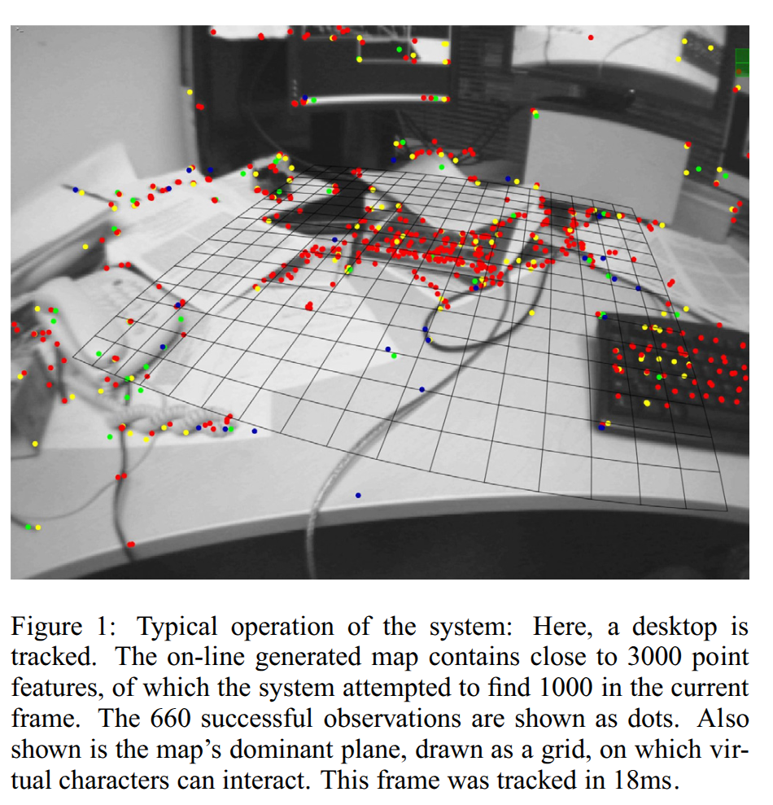
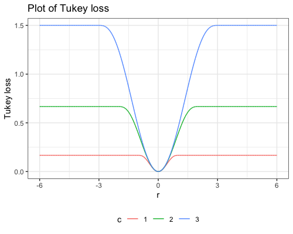
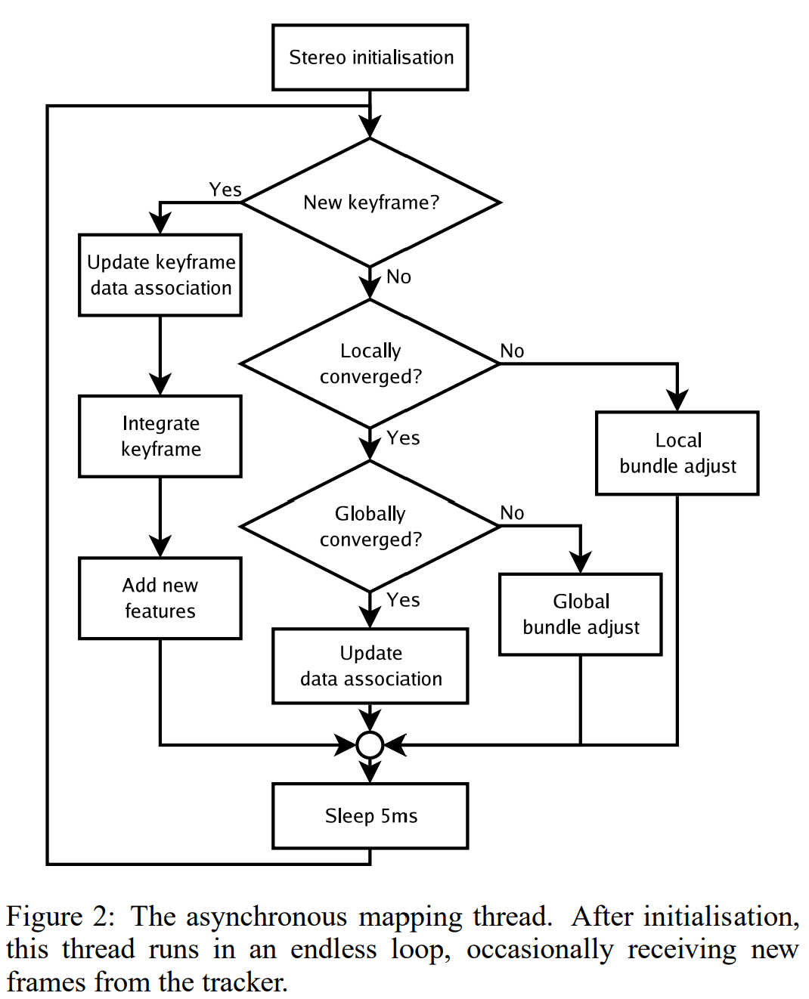
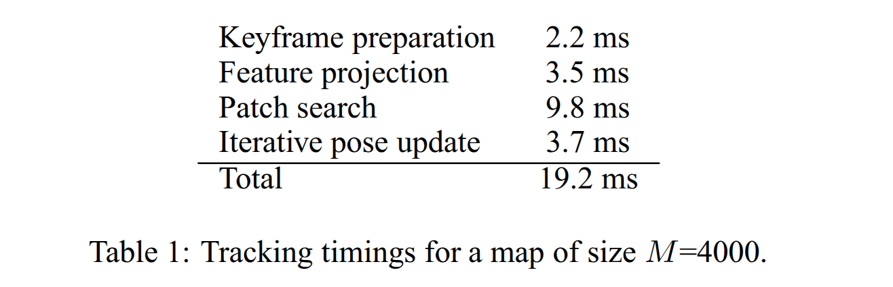
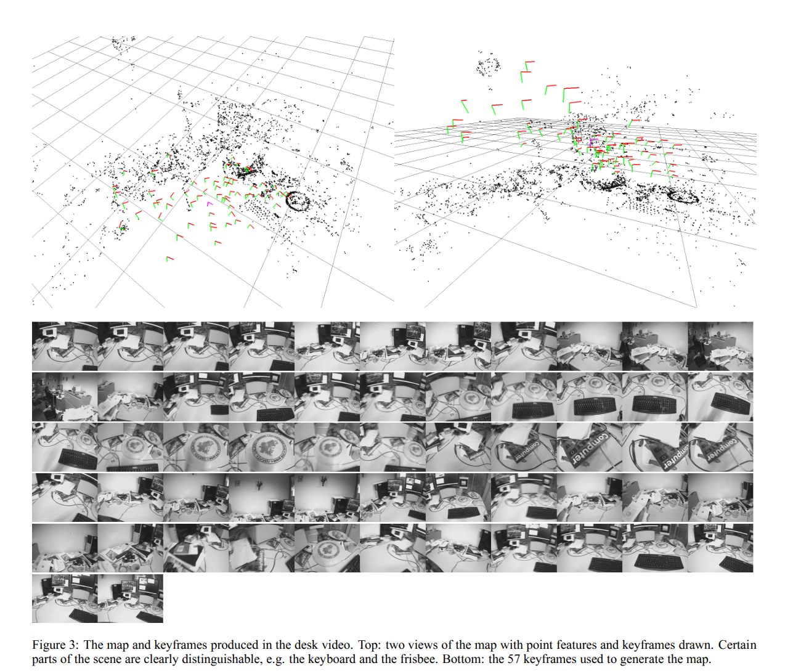
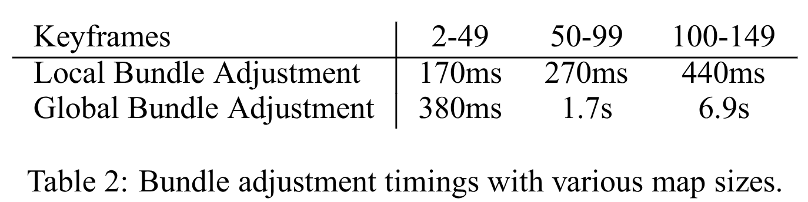
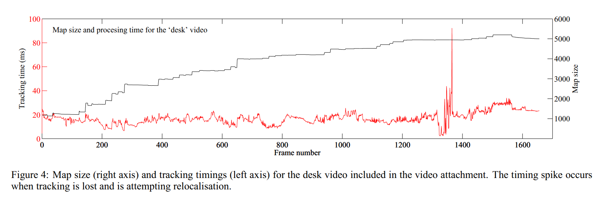
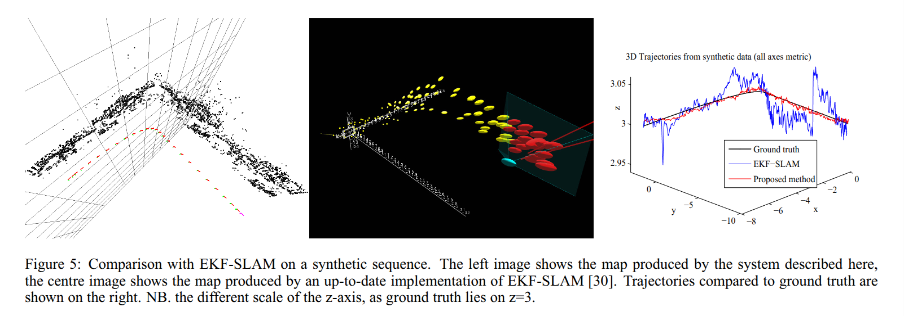
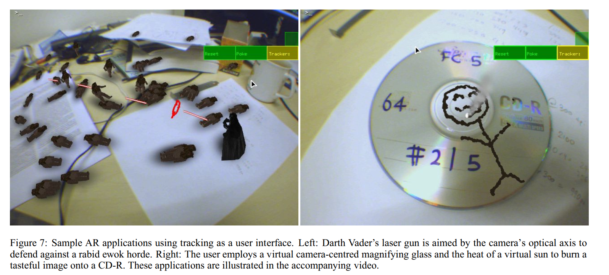

# Introduction
.pull-left.nt-01.f-90[
- 소규모 AR작업 공간에서 휴대용 카메라를 추적하도록 설계된 시스템 제안
- Registration: 현실 세계 특정 지점이 가상 세계 좌표와 일치하도록 실시간 매칭
- 실시간 camera pose 계산 위해 사전 지식인 지도(CAD, Fiducial Markers) 필요

&rarr; 사전 지식에 의존하는 방식에 벗어나고자  
Extensible Tracking, Parallel Threads, SLAM 방식 도입

||기존 SLAM방식|PTAM|
|:---|:---|:---|
|시스템 구조| intimately linked| two parallel threads|
|지도 작성| Incremental filtering | Batch optimization|
|데이터 사용량| Re-filtering every frame | Keyframe|
|지도 밀도| Sparse | Dense |
]
.pull-right.nt-02.nr-02[

]
---
## Method overview in the context of SLAM

- Tracking과 Mapping을 두 개의 Parallel Threads로 분리 실행

- Keyframe 기반 Mapping, Bundle Adjustment

- Stereo pair(5-point algorithm)으로부터 dense하게 초기화
- Epipolar search로 새로운 점 초기화

- 기존 대비 큰 지도 생성 

---
## The Map
- Textured patch 
    - 각 특징점이 8x8 픽셀크기의 Locally Planar라고 가정
    - Unit patch normal($n_j$)
    - Source keyframe($N$)
    - Pyramid level
$${}^W\boldsymbol{p}_j = ({}^Wx_j,{}^Wy_j, {}^Wz_j,1 )^\top \\{}^{K_i}\boldsymbol{E}_{W}$$
- Image pyramid
    - Keyframe을 4레벨의 greyscale 8bpp 이미지 피라미드로 저장
    - level 0 (640x480) &rarr; level3 (80x60)
???
카메라가 움직이면 각도에 따라 모습이 달라보이는데 법선 벡터를 알면 패치가 어떻게 warping될지 예측 가능
현재 카메라 영상과 matching해 tracking
i번째 키프레임에 대한 Ki 카메라 중심좌표계
bits per pixel
---
## coarse-to-fine Tracking
.nt-02[
1. Decaying velocity motion model로부터 prior pose 생성 후 projection
1. coarse단계
    - coarsest-scale에서 50개 특징점 검색
    - large radius로 탐색해 매칭 시도
    - 일부 패치에 대해서 subpixel refinement
    - 매칭으로부터 초기 pose update 
    (robust M-estimator + reweighted least squares)
1. fine 단계
    - 최대 1000개의 잠재적으로 보이는 패치 reprojection
    - 이전보다 좁은 radius로 탐색, 소수 패치에 대해서 subpixel refinement
    - coarse에서 얻은 매칭들과 합쳐 최종 pose update
]

### Image acquisition
.nt-02[
- Unibrain Fire-i video camera equipped
with a 2.1mm wide-angle lens
- 640 x 480 pixel YUV411 frames at 30Hz
- Prior pose estimation &rarr; Decaying velocity model ($v_t = \alpha \cdot v_{t-1}$)
- 각 피라미드 레벨에서 FAST-10 코너 검출기 실행
]
???
constant velocity랑 다른점은 측정 데이터가 들어오지 않으면 카메라 속도가 점점 줄어들고 멈춤
코너 검출은 비최대 억제없이 수행, 덩어리같은 코너 영역 클러스터 생성 
---
### Camera pose and projection

$$
\begin{align*}
{}^{c}\boldsymbol{p}_{j} &= {}^{c}\mathbf{E}_{W}{}^{W}\boldsymbol{p}_{j} \quad \mathbf{E}\in\mathbb{R}^{4\times4}, SE(3) \\[6pt]
\begin{pmatrix} u_i \\ v_i \end{pmatrix}
&= \mathrm{CamProj}({}^{c}\mathbf{E}_{W}{}^{W}\boldsymbol{p}_{i}) \\[6pt]
\mathrm{CamProj}
\begin{pmatrix} x \\ y \\ z \\ 1 \end{pmatrix}
&=
\begin{pmatrix} u_0 \\ v_0 \end{pmatrix}
+
\begin{bmatrix} f_u & 0 \\ 0 & f_v \end{bmatrix}
\frac{r'}{r}
\begin{pmatrix} \frac{x}{z} \\ \frac{y}{z} \end{pmatrix} \\[8pt]
r &= \sqrt{\frac{x^2+y^2}{z^2}} \\[6pt]
r' &= \frac{1}{\omega}\arctan\left(2r\tan\frac{\omega}{2}\right) \\[6pt]
{}^{c}\mathbf{E}'_{\mathrm{w}} &= M{}^{c}\mathbf{E}_{\mathrm{w}} = \exp(\mu){}^{c}\mathbf{E}_{\mathrm{w}}, \quad μ\in \mathbb{R}^6, \mathfrak{se}(3) \quad M\in\mathbb{R^{4\times4}}
\end{align*}
$$
???
E는 4x4 SE(3) Transformation matrix
M은 4x4 증분 camera motion
---
### Patch Search
- 3d map point($p$)가 현재 카메라 프레임의 어느 위치($u_c,v_c$)에 있는지 찾아내는 과정
- $Camproj()$ 로 투영된 픽셀 위치 근처에서 실제 특징점 패치를 찾고 reprojection error를 구하기 위함
1. Patch Warping (Affine Warp)

.pull-left[
$$\mathbf{A} = \begin{bmatrix}
    \frac{\partial u_c}{\partial u_s} & \frac{\partial u_c}{\partial v_s} \\
    \frac{\partial v_c}{\partial u_s} & \frac{\partial v_c}{\partial v_s}\end{bmatrix}$$
    ]
    
.pull-right.f-90[
- ${u_s,v_s}$ : source keyframe
- ${u_c,v_c}$ : current keyframe
- $\mathbf{A}$ : source에서 1px 움직일때 current가 얼마나 움직이는지 Jacobian
]

.mt-02[
&rarr; Performing these projections ensures that the warping matrix compensates (to first order) not only **changes in perspective** and
**scale** but also the **variations in lens distortion** across the image.
]
---
2. 이미지 피라미드 레벨 선택
   - 특징점이 이미지 피라미드 레벨에서 어떤 크기로 보일지 계산
   1. $det(\mathbf{A})$ : 단위 픽셀 면적인 현재 프레임(level 0)에서 몇 픽셀 면적 차지하는지
   2. $\frac{det(\mathbf{A})}{4^l}$ : 피라미드 레벨별 면적 감소량 계산해 1에 가까운 레벨을 특징점의 source level로 선택
3. 패치 템플릿 생성 및 매칭
  - 특징점 찾기 위해 현재 시점에 맞게 변형된 이미지 템플릿 생성
  1. source keyframe에 젖아된 특징점 패치를 현재 카메라 각도에 맞춰 워핑행렬 $\frac{A}{2^l}$ 적용해 변형
  2. 변형된 좌표를 정수 픽셀에 위치 시키기 위해 주변 4개 픽셀값을 가중평균 (Bilinear interpolation)
  3. 조명 보정 위해 8x8 패치 내 모든 픽셀 평균 밝기값을 뺌 (Zero-mean)
  4. FAST 코너 위치에 대해 SSD(Sum of Squared Differences) 계산해 차이 적고 임계값보다 낮으면 특징점이 있다고 판단 
  $$SSD = \Sigma(I_{template}-I_{target})^2$$
---
4. Sub-pixel refinement
  - 상위 피라미드 레벨 일부 특징점들에 우선 적용해 추적 정확도 높임
  - Lucas-Kanade는 매 반복마다 이미지 gradient가 달라져 느림
  - IC(Inverse Compositional)로 타겟 이미지 대신 템플릿으로 $H^{-1}$ 구해 이미지 보정 값 계산
.f-80[
  $$\sum_{\mathbf{x}} [T(\mathbf{W}(\mathbf{x}; \Delta \mathbf{p})) - I(\mathbf{W}(\mathbf{x}; \mathbf{p}))]^2$$
  $$\Delta \mathbf{p} = H^{-1} \sum_{\mathbf{x}} \left[ \nabla T \frac{\partial \mathbf{W}}{\partial \mathbf{p}} \right]^T [I(\mathbf{W}(\mathbf{x}; \mathbf{p})) - T(\mathbf{x})]$$
  $$H = \sum_{\mathbf{x}} \left[ \nabla T \frac{\partial \mathbf{W}}{\partial \mathbf{p}} \right]^T \left[ \nabla T \frac{\partial \mathbf{W}}{\partial \mathbf{p}} \right]$$
  $$\mathbf{W}(\mathbf{x}; \mathbf{p}) \leftarrow \mathbf{W}(\mathbf{x}; \mathbf{p}) \circ \mathbf{W}(\mathbf{x}; \Delta \mathbf{p})^{-1}$$
.right.caption[S. Baker and I. Matthews, "Equivalence and efficiency of image alignment algorithms," CVPR 2001]
]
.f-80[
    - $T(x)$ : 템플릿 이미지 밝기
    - $I(x)$ : 현재 입력 이미지 밝기
    - $\mathbf W(\mathbf x; \mathbf p)$ : 파라미터 $\mathbf p$에 의해 정의된 좌표 변환 함수
    - $\nabla T$ : 템플릿 이미지의 밝기 변화량
    - $\frac{\partial{W}}{\partial{p}}$ : 워프함수의 자코비안
]
---
### Pose Update
- reprojection error 정의
$$e_j = \begin{pmatrix} \hat{u}_j \\ \hat{v}_j \end{pmatrix} - \operatorname{CamProj}\left(\exp(\mu) E_{cw} p_j\right)$$
- 
Iteratively Reweighted Least Squares (IRLS)
$$\mu' = \underset{\mu}{\operatorname{argmin}} \sum_{j \in S} \operatorname{Obj}\left(\frac{|e_j|}{\sigma_j}, \sigma_T\right)$$
  - $\sigma_j$ : 측정 노이즈, $\sigma^2 = 2^{2l}$ 적용해 해상도 낮은 레벨에서 찾을수록 오차 허용
  - $\operatorname{Obj}\left(\cdot, \sigma_T\right)$ : Tukey biweight 손실함수
.right.mr-20[]
---
### Tracking quality and failure recovery
- 매 프레임 마다 성공 관측 비율로 추적 품질 추정
- motion blur, occlusion, incorrect position estimate
- 추적 품질이 좋지 않을경우 추적 복구 절차 시작
1. 현재 프레임에서 특징 뽑음
2. descriptor로 저장된 keyframe에서 유사 후보 검색
3. 후보 keyframe에 연결된 3d point로 3d-2d 대응 구성
4. PnP RANSAC으로 초기 포즈 푸정
5. reprojection error 최소화해 포즈 정밀화
---
# Mapping
.nt-02.pull-left[
- Map initialization
    1. 사용자가 카메라를 평행이동하며 키를 눌러 keyframe 생성
    2. 첫 keyframe에서 고해상도 레벨에 있는 FAST 코너를 2d patch 후보로 초기화
    3. essential matrix 추정 후 triangulation으로 초기 3d map 생성 &rarr; BA
    - 스케일 고정을 위해 baseline을 10cm로 가정
    - plane에 맵을 맞추기 위해 삼중점을 RANSAC으로 선택해 dominant plane계산 (최적화하지 않음 )
]
.nt-03[
.pull-right.right[]
]
---
### keyframe insertion and epipolar search
.f-85.nt-01[
- keyframe 선정 조건
  - 트래킹 품질 좋음
  - 마지막 keyframe이후 20 프레임 경과
  - 관찰된 point들의 평균 깊이에 따라 최소 거리 결정
- keyframe 생성시 처리
    - tracking thread: 추정한 pose와 특징 관측값으로 초기화 
    - mapping thread: tracking에서 측정 못한 가시 포인트 reprojection해 추가 관측 시도
- Epipolar Search 
    1. 후보점 선정
        - 새 keyframe의 각 피라미드 레벨에서 계산해둔 FAST 코너 후보 불러옴
        - NMS, Shi-Tomasi 점수로 잘 구별되는 코너만 남김
        - 기존 관측 근처인 후보 제외해 신규 3d point 후보 생성
    1. 대응 keyframe 선택
        - 각 후보를 triangulation할 두번째 뷰를 이미 있는 keyframe 중 카메라 중심과 거리가 가장 작은것 선택
    1. matching
        - keyframe의 관찰 point의 깊의 분포로 깊이 prior 설정해 탐색 범위 제한
        - 동일 피라미드 레벨에서 epipolar search(zero-mean SSD)
        - SSD가 임계값 이하일 경우 triangulation, map에 추가
]
---
.f-90[
- structure matrix $\mathbf{M}$
$$\mathbf{M} = \sum_{x, y} w(x, y) \begin{pmatrix} I_x^2 & I_x I_y \\ I_x I_y & I_y^2 \end{pmatrix}$$
$$w(u,v) = \exp\left(-\frac{u^2+v^2}{2\sigma^2}\right)$$

- Shi-Tomasi (Good Features to Track)
$$\text{score} = \min(\lambda_1, \lambda_2)$$
]
???
R이 크면 코너 강도가높음 
min 람다가 임계값보다 크면 코너

---
### Bundle Adjustment
- reprojection error

$$\mathbf{e}_{ji}=\begin{bmatrix}\hat u_{ji}\\\hat v_{ji}\end{bmatrix}-\mathrm{CamProj}\!\big(\exp(\mu)\,E_{CW}\,p_j\big).$$
- Global BA

$$\{ \hat{\mu}_2,\dots,\hat{\mu}_N,\hat{p}_1,\dots,\hat{p}_M\}=\arg\min_{\{\mu\},\{p\}}\sum_{i=1}^{N}\sum_{j\in S_i}\mathrm{Obj}\!\big(\,|\mathbf{e}_{ji}|_{\sigma_{ji}},\sigma_T\big).$$
- Local BA
$$\{\hat{\mu}_x\}_{x\in X},\ \{\hat{p}_z\}_{z\in Z}=\arg\min_{\{\mu\},\{p\}}\sum_{i\in X\cup Y}\sum_{j\in Z\cap S_i}\mathrm{Obj}(i,j).$$
???
지도 확장시에만 local ba
최적화할 키프레임X과 관측되는 맵Z, 포인트 관측한 키프레임 집합 Y(과거에 최적화된 키프레임으로 고정되어있음)
lie 파라미터 뮤, 관측이 픽셀과 표준편차 가짐
에러는 표준편차로 정규화됨
시그마t는 tukey인 m estimator에서 사용하는 스케일 추정치
구현은 LM
---
### Data associatoin refinement
.f-90.nt-01[
-  mapping thread가 여유있는 시간에 새로운 point의 관측 집합을 추가하고 outlier 재측정
- 우선순위가 낮은 process로 새 keyframe이 들어오면 중단
1. 과거 keyframe에서 해당 point가 보이는지 재측정후 관측 추가
1. BA에서 Tukey에 의해 가중치가 작아진(잔차가 큰) 원래 추적보다 좁은 radius로 해당 패치를 다시 찾음
]

### General implementation notes
.f-90.nt-01[
- Intel Core 2 Duo 2.66 GHz processor running Linux
- C++ using the libCVD and TooN libraries
- M-estimator 반복시 네번에 한번 reprojection, Jacobian 계산
- 지도 점 $M > 600$, keyframe $N > 150$ 일 경우 실시간 BA 불가
- 일부 outlier, keyframe을 휴리스틱으로 처리
]
???
추가된 새 포인트는 two view에서만 있으므로 관측 집합을 풍부하게함
---
# Results
- Tracking performance on live video
    - 책상 및 주변 1,656 프레임의 실시간 비디오 입력
    - Panning, Zoom-in, 빠른 움직임의 카메라 동작
    - 의도적으로 카메라를 흔들어 추적 실패하게하고 Recovery 하는지 확인
    - Keyframe 57개, Feature Points 4,997개
    - 이미지 피라미드의 가장 세밀한 레벨(51%), 거친 레벨(7%)에 특징점 분포
    - Relocalisation: 추적이 끊겨 다시 위치를 찾을 때 최대 90ms
.center.mt-01[]
---
# Results
.center.nt-02[]
---
# Results
.nt-02[
- Mapping scalability
    - Mapping thread에서 지도가 커짐에 따라 성능 저하
    - 한계 제시: 6,000개 feature $M$, 150개 Keyframe $N$ 
    - Bundle Adjustment의 계산 비용
        - Global: $O(N^3)$, 실제 구현 시 $O(N^2M)$
        - Local: $O(NM)$
]
.center.mt-01[]
.center.mt-01[]
---
# Results
.nt-01[
- Synthetic comparison with EKF-SLAM
    - 두 벽면이 직각으로 만나는 가상 공간 활용해 Ground truth를 알고 있는 상태에서 오차 측정
    - 18.2m 거리 600 프레임 동안 이동

||EKF-SLAM|PTAM|
|:---|:---|:---|
|특징점 개수|6,600|114|
|정확도| 6mm|135mm|
|Tracking 성능| 20ms|3ms~40ms|
.center[]
]
???
andrew davison의 monoslam을 개선한 real time slam relocalisaition버전의 ekf slam
ekf는 모든 특징점 간 covariance를 계산해야함 연산량 많음 
PTAM은 ba해서 더 정밀하게 가능 
---
# Results
.nt-02[
- Subjective comparison with EKF-SLAM
  - SLAM wiggle: 특징점 depth를 추정하기 위해 카메라를 부드럽게 움직여야함 
  - Scalability: 지도가 커질수록 특징 점수의 세제곱까지 비례해 증가
  - Image Pyramid기법으로 Zoom-in,out에 강건성 보임 
- AR with a hand-held camera 
  - initialisation 완료시 즉시 AR application 사용 가능
  - 카메라가 가상 세계와 상호작용하는 UI 도구로 사용 
  - Ewok Panpage(슈팅게임), Virtual Magnifying Glass(가상 돋보기) 등 
]
.center[]
---
# 한계점
1. corner 특징점 의존해 motion blur에 취약 
&rarr;
1. 반복된 구조일 경우 epipolar search에 outlier 발생  
&rarr;
1. Loop closing 부재 
&rarr;
1. map point cloud의 기하학적 정보 부족으로 Occlusion 처리 불가 
&rarr;
1. Relocalizaiton의 viewpoint 불변성 부족 
&rarr;
1. initialization에 인간 개입 필요 
&rarr;

